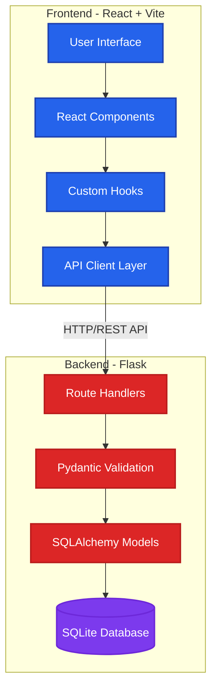

# 📚 Bookmark Manager

A modern, full-stack bookmark management application built with Flask and React. Organize your favorite links with tags, search functionality, and a clean, intuitive interface.



## ✨ Features

- **📝 Bookmark Management**: Create, read, update, and delete bookmarks
- **🏷️ Tag System**: Organize bookmarks with tags (auto-created, reusable)
- **🔍 Advanced Search**: Search by title or notes with debounced input
- **📊 Filtering**: Filter by tags, read/unread status, or combine filters
- **✅ Read Status**: Mark bookmarks as read/unread with visual indicators
- **📱 Responsive Design**: Mobile-friendly interface built with Tailwind CSS
- **🎨 Modern UI**: Clean, minimal design with smooth interactions
- **🛡️ Input Validation**: Client and server-side validation with Pydantic
- **⚡ Fast Performance**: Optimized queries and efficient state management

## 🛠️ Tech Stack

### Frontend
- **React 18** - UI library with hooks
- **Vite 5** - Build tool and dev server
- **Tailwind CSS 3** - Utility-first CSS framework
- **Axios** - HTTP client for API calls

### Backend
- **Flask** - Python web framework
- **SQLAlchemy 2.x** - Modern ORM with type hints
- **Pydantic v2** - Data validation and serialization
- **SQLite** - Lightweight database
- **Flask-CORS** - Cross-origin resource sharing

## 📋 Prerequisites

- **Python 3.10+**
- **Node.js 18+** and npm/pnpm
- **Git**

## 🚀 Quick Start

### 1. Clone the Repository

```bash
git clone <repository-url>
cd bookmark-manager
```

### 2. Backend Setup

```bash
# Create virtual environment (recommended)
python -m venv .venv

# Activate virtual environment
# On Linux/Mac:
source .venv/bin/activate
# On Windows:
# .venv\Scripts\activate

# Install dependencies
pip install flask flask-sqlalchemy flask-cors pydantic[email] python-dotenv pytest pytest-flask

# Run the backend server
python -m backend.run
```

The backend will start on `http://localhost:5000`

### 3. Frontend Setup

```bash
# Navigate to frontend directory
cd frontend

# Install dependencies
npm install
# or
pnpm install

# Start development server
npm run dev
# or
pnpm run dev
```

The frontend will start on `http://localhost:5173`

### 4. Environment Configuration

Create a `.env` file in the `frontend/` directory:

```env
VITE_API_URL=http://localhost:5000
```

## 📁 Project Structure

```
bookmark-manager/
├── backend/                    # Flask backend application
│   ├── app/
│   │   ├── __init__.py        # Flask app factory
│   │   ├── models.py          # SQLAlchemy models
│   │   ├── schemas.py         # Pydantic validation schemas
│   │   └── routes/
│   │       ├── bookmarks.py   # Bookmark CRUD endpoints
│   │       └── tags.py        # Tag endpoints
│   ├── tests/                 # pytest test suite
│   │   ├── test_bookmarks.py
│   │   └── test_tags.py
│   ├── config.py              # Configuration classes
│   └── run.py                 # Application entry point
│
├── frontend/                  # React frontend application
│   ├── src/
│   │   ├── api/               # API client layer
│   │   │   ├── bookmarks.js
│   │   │   └── tags.js
│   │   ├── components/        # React components
│   │   │   ├── BookmarkCard.jsx
│   │   │   ├── BookmarkForm.jsx
│   │   │   ├── BookmarkList.jsx
│   │   │   ├── TagFilter.jsx
│   │   │   ├── SearchBar.jsx
│   │   │   ├── Modal.jsx
│   │   │   ├── EmptyState.jsx
│   │   │   ├── ErrorMessage.jsx
│   │   │   └── LoadingSpinner.jsx
│   │   ├── hooks/             # Custom React hooks
│   │   │   ├── useBookmarks.js
│   │   │   └── useTags.js
│   │   ├── pages/              # Page components
│   │   │   └── HomePage.jsx
│   │   ├── utils/              # Utility functions
│   │   │   └── validators.js
│   │   ├── App.jsx
│   │   └── main.jsx
│   ├── package.json
│   └── vite.config.js
│
├── architecture/              # Architecture documentation
│   ├── 01-system-overview.md
│   ├── 02-database-schema.md
│   ├── 03-frontend-structure.md
│   ├── 04-api-endpoints.md
│   └── 05-data-flow.md
│
├── claude.md                  # AI coding guidelines
└── README.md                  # This file
```

## 🔌 API Endpoints

### Bookmarks

| Method | Endpoint | Description |
|--------|----------|-------------|
| `GET` | `/api/bookmarks` | List bookmarks (supports `?tag=`, `?search=`, `?is_read=` filters) |
| `POST` | `/api/bookmarks` | Create a new bookmark |
| `GET` | `/api/bookmarks/<id>` | Get a single bookmark |
| `PUT` | `/api/bookmarks/<id>` | Update a bookmark |
| `DELETE` | `/api/bookmarks/<id>` | Delete a bookmark |
| `PATCH` | `/api/bookmarks/<id>/read` | Toggle read/unread status |

### Tags

| Method | Endpoint | Description |
|--------|----------|-------------|
| `GET` | `/api/tags` | List all tags with bookmark counts |
| `DELETE` | `/api/tags/<id>` | Delete a tag (only if no bookmarks attached) |

### Response Format

All API responses follow this structure:

```json
{
  "success": true,
  "data": {...} | [...],
  "error": null
}
```

## 🧪 Testing

### Backend Tests

```bash
# Run all tests
pytest

# Run with coverage
pytest --cov=backend

# Run specific test file
pytest backend/tests/test_bookmarks.py
```

Tests use an in-memory SQLite database and are isolated between runs.

## 📚 Documentation

Detailed architecture documentation is available in the [`architecture/`](./architecture/) directory:

- **[System Overview](./architecture/01-system-overview.md)** - High-level architecture and tech stack
- **[Database Schema](./architecture/02-database-schema.md)** - ER diagrams and data models
- **[Frontend Structure](./architecture/03-frontend-structure.md)** - Component hierarchy and data flow
- **[API Endpoints](./architecture/04-api-endpoints.md)** - Complete API documentation
- **[Data Flow](./architecture/05-data-flow.md)** - Sequence diagrams for key operations

## 🎯 Key Features Explained

### Tag System
- Tags are automatically created when referenced in bookmarks
- Tag names are normalized to lowercase
- Tags can only be deleted if no bookmarks are attached
- Tags support alphanumeric characters and hyphens only

### Search & Filtering
- Search queries are debounced (300ms) to reduce API calls
- Filters can be combined (tag + search + read status)
- All filtering happens server-side for better performance

### Validation
- **Frontend**: URL validation, title length checks, tag format validation
- **Backend**: Pydantic schemas validate all requests before database operations
- Duplicate URLs return `409 Conflict` with clear error messages

## 🔒 Security & Best Practices

- ✅ Input validation on both client and server
- ✅ SQL injection protection via SQLAlchemy ORM
- ✅ CORS enabled for cross-origin requests
- ✅ Error messages never expose internal details
- ✅ Environment variables for configuration
- ✅ Type hints throughout Python codebase
- ✅ Consistent error handling patterns

## 🤝 Contributing

This project follows strict coding standards defined in [`claude.md`](./claude.md). Key principles:

- Always validate requests with Pydantic schemas
- Never expose raw database errors to clients
- Use hooks for state management, not component-level API calls
- Write tests for all new endpoints
- Keep components focused and under 150 lines

## 📝 License

This project is open source and available for personal and educational use.

## 🐛 Troubleshooting

### Backend won't start
- Ensure Python 3.10+ is installed
- Check that all dependencies are installed: `pip list`
- Verify the database file permissions

### Frontend can't connect to backend
- Ensure backend is running on `http://localhost:5000`
- Check `frontend/.env` has correct `VITE_API_URL`
- Verify CORS is enabled in Flask app

### Database errors
- Delete `bookmark_manager_dev.db` to reset the database
- Ensure SQLite is installed on your system
- Check file permissions in the backend directory

---

**Built with ❤️ using Flask and React**
