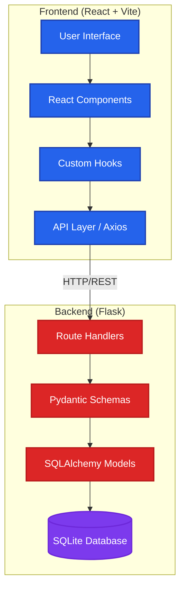

# System Architecture Overview

## Technology Stack

### Frontend
- **Framework**: React 18+ (Functional Components + Hooks)
- **Build Tool**: Vite 5
- **Styling**: Tailwind CSS 3
- **HTTP Client**: Axios
- **Port**: 5173 (dev)

### Backend
- **Framework**: Flask
- **ORM**: SQLAlchemy 2.x
- **Validation**: Pydantic v2
- **Database**: SQLite
- **CORS**: flask-cors
- **Port**: 5000

## Communication Flow

1. User interacts with React components
2. Components use custom hooks (`useBookmarks`, `useTags`)
3. Hooks call API layer functions (`src/api/bookmarks.js`, `src/api/tags.js`)
4. API layer makes HTTP requests to Flask backend
5. Flask routes validate requests with Pydantic schemas
6. Validated data is processed by SQLAlchemy models
7. Database operations execute on SQLite
8. Responses flow back through the same layers
