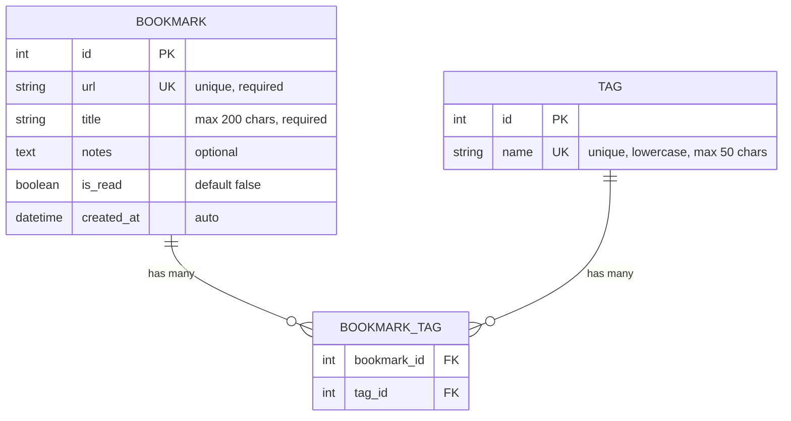

# Database Schema

## Table Details

### `bookmarks`
- **Primary Key**: `id` (auto-increment integer)
- **Unique Constraint**: `url` (prevents duplicate bookmarks)
- **Relationships**: Many-to-many with `tags` via `bookmark_tags`

### `tags`
- **Primary Key**: `id` (auto-increment integer)
- **Unique Constraint**: `name` (lowercase, normalized)
- **Relationships**: Many-to-many with `bookmarks` via `bookmark_tags`

### `bookmark_tags` (Association Table)
- **Composite Primary Key**: (`bookmark_id`, `tag_id`)
- **Foreign Keys**: 
  - `bookmark_id` → `bookmarks.id`
  - `tag_id` → `tags.id`

## Business Rules

1. **Tag Normalization**: All tag names are stored in lowercase
2. **Tag Validation**: Tag names must be alphanumeric + hyphens only (no spaces)
3. **Duplicate Prevention**: URLs must be unique across all bookmarks
4. **Tag Deletion**: Tags cannot be deleted if they have associated bookmarks
5. **Auto-creation**: Tags are automatically created when referenced in a bookmark
