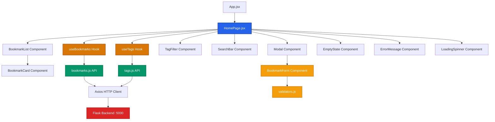

# Frontend Component Structure

## Component Hierarchy

### Pages
- **`HomePage.jsx`**: Main application page, orchestrates all components

### Components
- **`BookmarkCard.jsx`**: Displays a single bookmark with actions
- **`BookmarkList.jsx`**: Grid layout of BookmarkCard components
- **`BookmarkForm.jsx`**: Form for creating/editing bookmarks
- **`TagFilter.jsx`**: Sidebar tag filter with counts
- **`SearchBar.jsx`**: Search input with read/unread filter
- **`Modal.jsx`**: Reusable modal wrapper with focus trap
- **`EmptyState.jsx`**: Shown when no bookmarks match filters
- **`ErrorMessage.jsx`**: Displays error messages
- **`LoadingSpinner.jsx`**: Loading indicator

### Hooks
- **`useBookmarks.js`**: Manages bookmark state, filters, and CRUD operations
- **`useTags.js`**: Manages tag state and fetching

### API Layer
- **`bookmarks.js`**: All bookmark-related API calls
- **`tags.js`**: All tag-related API calls

### Utils
- **`validators.js`**: URL validation and input parsing helpers

## Data Flow

1. **User Action** → Component event handler
2. **Component** → Calls hook function
3. **Hook** → Calls API function
4. **API** → Makes HTTP request to backend
5. **Response** → Flows back through layers
6. **Hook** → Updates state
7. **Component** → Re-renders with new data
