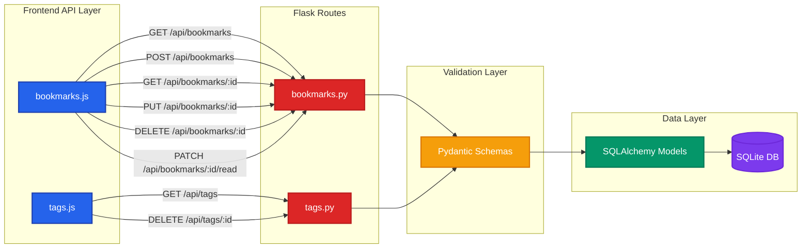

# API Endpoints Architecture



## Endpoint Details

### Bookmarks API

| Method | Endpoint | Description | Query Params |
|--------|----------|-------------|--------------|
| GET | `/api/bookmarks` | List all bookmarks | `tag`, `search`, `is_read` |
| POST | `/api/bookmarks` | Create new bookmark | - |
| GET | `/api/bookmarks/<id>` | Get single bookmark | - |
| PUT | `/api/bookmarks/<id>` | Update bookmark | - |
| DELETE | `/api/bookmarks/<id>` | Delete bookmark | - |
| PATCH | `/api/bookmarks/<id>/read` | Toggle read status | - |

### Tags API

| Method | Endpoint | Description | Query Params |
|--------|----------|-------------|--------------|
| GET | `/api/tags` | List all tags with counts | - |
| DELETE | `/api/tags/<id>` | Delete tag (if no bookmarks) | - |

## Request/Response Format

### Standard Response Structure
```json
{
  "success": true|false,
  "data": {...} | [...],
  "error": null | "error message"
}
```

### Error Handling Flow

1. **Validation Error** (400): Pydantic schema validation fails
2. **Not Found** (404): Resource doesn't exist
3. **Conflict** (409): Duplicate URL or constraint violation
4. **Server Error** (500): Database or unexpected error (logged, not exposed)

## Validation Rules

- **URL**: Must be valid http/https URL (Pydantic HttpUrl)
- **Title**: Required, max 200 chars, cannot be whitespace-only
- **Tag Names**: Lowercase, alphanumeric + hyphens only
- **Duplicate URLs**: Returns 409 Conflict
- **Tag Deletion**: Returns 400 if bookmarks attached
