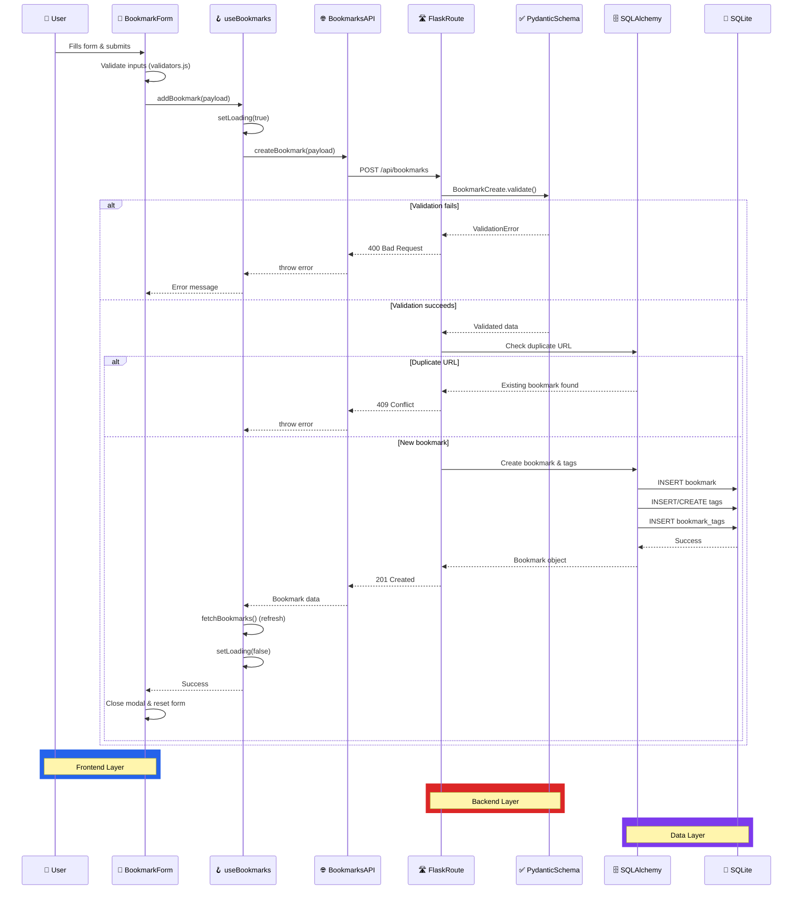
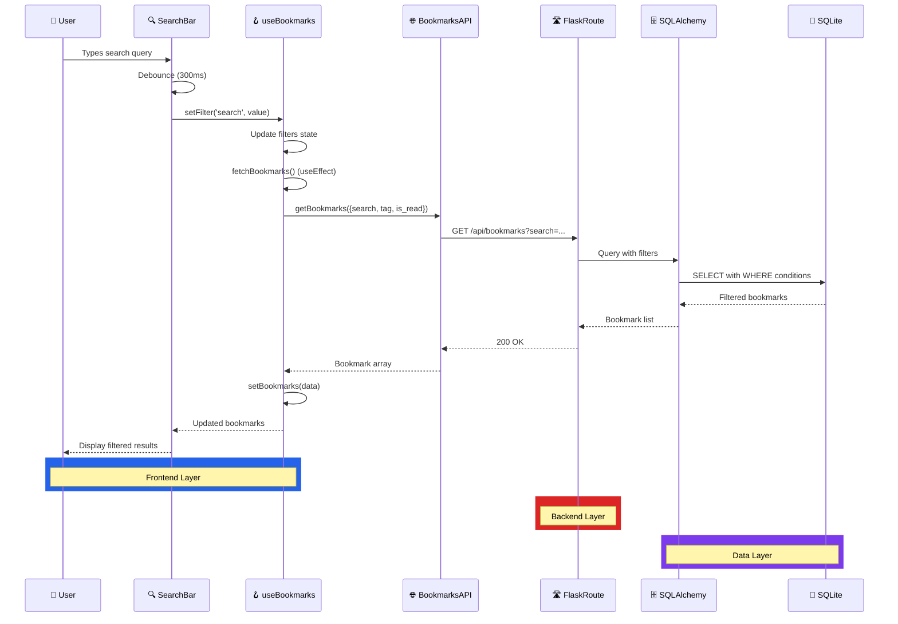
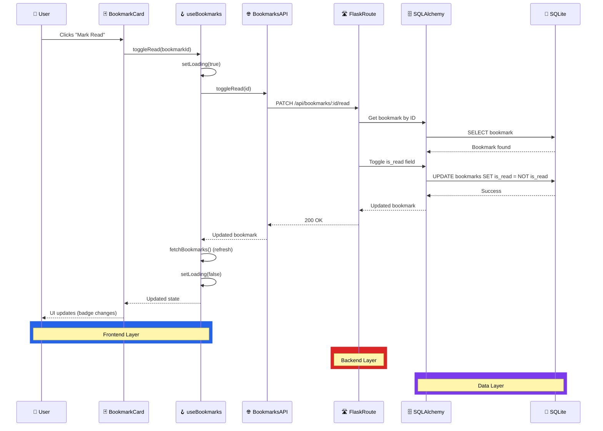

# Data Flow Diagrams

## Creating a Bookmark

## Filtering Bookmarks

## Toggle Read Status

## Key Patterns

1. **Always validate** at the schema layer before DB operations
2. **Always refetch** after mutations to ensure consistency
3. **Debounce search** to avoid excessive API calls
4. **Handle errors** at every layer with user-friendly messages
5. **Loading states** shown during all async operations
6. **Optimistic updates** not used - always wait for server confirmation
